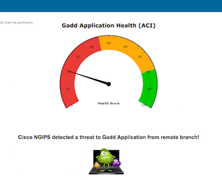
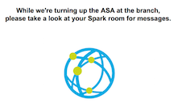
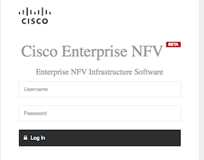
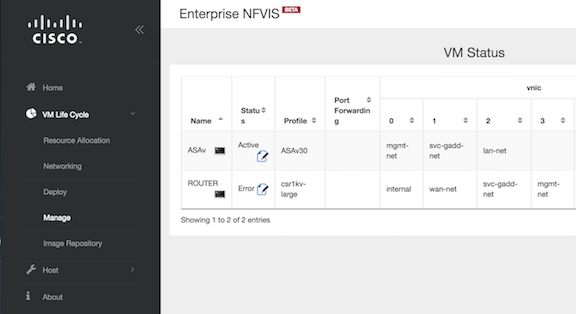
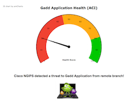

# gadd
##**Gomorrah Automated Distributed Defense**

# Description - Phase 1 (simulation phase)

The demo will highlight Spark and NFVIS along with ACI* and NGIPS*. The idea of the demo is:  based on an event/alert in the datacenter, dynamically deploy a FW at offending remote branch and post notifications in a Spark room. The branch site has a NFVis device and only has a virtual router deployed/functioning as a starting point.

For phase 1, we currently don't actually have an IPS in the lab, so we'll __simulate__ the attack event. However, we do have ACI. Using the APIC APIs, we will gather health statistics of a tenant along with ingress/egress stats and send the information to our Spark room to __simulate__ network impact.  

In Phase 2 the plan is to have an actual IPS to provide 'real' events to an actual server runnning on an ACI fabric. Therefore it's important to note that for Phase 1, this demo ***is*** dependent on the ACI hardware inside our Chgo lab. To reiterate, please see the following notes:

* ***NOTE 1 - Phase 1: We'll be leveraging the local/internal labs for ACI and a NFVIS device, so you'll need connectivity to Cisco specific labs documented in this README. However in phase 2, pending future deployments within Cisco DevNet/Sandbox and Mantl.io, this requirement should change.*** 

* ***NOTE 2 - Phase 2: When we do have Phase 2 built, we'll provide documentation on how you can deploy/run this demo in your own lab.***

# Installation

## Environment

**Prerequisites**

* [Docker](https://docs.docker.com/engine/installation/mac/), running on a MAC. (Docker PC version of this document is coming at a later date).
* An account on: [developer.ciscospark.com](developer.ciscospark.com). (Create an account if you already don't have one).
* A Cisco Spark account: [web.ciscospark.com](web.ciscospark.com). (Create an account if you already don't have one). 
* If you don't have docker or are running a PC, we can run the demo with native python. However, you'll need to the following.
		
	* Python 2.7+ 
	* [virtualenv](http://docs.python-guide.org/en/latest/dev/virtualenvs/)
	* [setuptools package](https://pypi.python.org/pypi/setuptools) (we'll do this during the acitoolkit install)
	* [acitoolkit](http://datacenter.github.io/acitoolkit/) (installed in a virtualenv, which we'll cover later in this doc.)

## Downloading

We'll need to download the docker container and the repo files.

**Get the container:**

The latest build of this project is available as a Docker image from Docker Hub

    docker pull cpuskarz/gadd:2

**Get the repo:**

If you have git installed, clone the repository. 

    git clone https://github.com/imapex/gadd

If you don't have git, download a zip copy of the repository
and extract.

## Installing

We'll cover a two ways to install and run this demo. You have a choice of using either:  
**- Docker container (with GUI)**   
**- Running the python app native on our laptop (with GUI).** 

##Option A: Running the Docker container (MAC)
 
###Setup 
After downloading the container and cloning/downloading the repo per above:

* Open a terminal and navigate into your downloaded repo directory
* cd into the``gadd``directory
* To make sure there's not an ASA deployment on the NFV device lingering from a previous demo, we'll setup your credentials and prepare the environment with two scripts. But first we'll need your Spark Token.
* To obtain your own token:  
	* log into``developer.ciscospark.com``.
	* Click the picture icon in the upper right hand corner of the page and copy your token from the pop-up window.
	* NOTE: To run this demo you'll need URL's and credentials. Please contact me at: ``cpuskarz@cisco.com`` for this information.

		* Next, in your terminal enter:  ``source gadd_setup.sh``  
		 and answer the questions at the prompts. 

		* NFVIS URL:			``<NFVIS DEVICE URL>``
		* NFVIS LOGIN:		``<NFV LOGIN>``
		* NFVIS PASSWORD:	``<NRF PASSWORD>``
		* SPARK TOKEN:		``<paste your token here>``
		* APIC URL:			``<APIC URL>``
		* APIC LOGIN:			``<APIC LOGIN>``
		* APIC PASSWORD:		``<APIC PASSWORD>``
		* TRIGGER IP:			``<TRIGGER IP>``
		 
* Next lets make sure the NFVIS device is clean, enter:

		source prep_nfvis.sh

---
		 
###---- Optional Section A1 ----

PLACEHOLDER 

####---- End of Optional Section A1 ----  

--- 
	
###Setup continued	        
* Let's start up the container by running the following command, (make sure you're in the``gadd``directory and terminal you were in earlier):

		docker run -d -P --env-file=gadd_dock_env --name=gadddemo cpuskarz/gadd:2 
		
* We'll need the port number. ***Open another terminal window (don't close your current one).*** Enter:

		docker ps
		
	* You should see output similar to below. Take note of the **PORTS** number, for example**``32794``**:

	

	* You'll need your docker-machine IP address. If you don't know the IP, in your terminal window, type:``docker-machine ip``).  
	
	
Okay, now lets run the demo.

###Usage  

* Open your Spark client of choice.

* Open a browser to``http://<your docker up address>:<PORT_num>``. For example:

		http://192.168.99.100:32794
		

* You'll see something like this showing the application healthscore from ACI:

  
 

* Click the virus icon and watch for messages in Spark client (a new room called Gadd Alert Room will be created for you). 
* Once the messages complete and the NFV deployment, your webpage should change to:  

 

* Click the globe icon and you'll be taken back to the ACI healthscore page but with much better health!.  

* Click on the MAC icon to be taken to the NFV login page. Login with``admin / admin``.

* Naviate the menu on the left panel: ****VM Life Cycle / Manage****. Here, you can see that an ASA has been deployed.

--- 

### ---- Optional Section A2 ----  

PLACEHOLDER

#### ---- End of Optional Section A2 ----  
---

* When you're done with the demo, we need to clean up after ourselves. You should still have the same terminal window open and are in the``gadd``directory, enter:

		docker stop gadddemo
		source cleanup_nfvis.sh
		docker rm gadddemo  
		
* Optional command. This will delete the docker container
		
		docker rmi cpuskarz/gadd:2

#_____________________________________

##Option B: Python app on your laptop without Docker. 

###Setup

After cloning or downloading the repo to your laptop, (per above):

* open a terminal and navigate into your downloaded repo directory
* cd into the``gadd``directory
* Instantiate a [virtualenv](http://docs.python-guide.org/en/latest/dev/virtualenvs/) environment, for example:

		virtualenv venv
		source venv/bin/activate
* You should now be in a virtual enviroment (venv) terminal to load additional packages. From your venv enabled terminal window run:

		pip install --requirement requirements.txt
		
* install the [acitoolkit](http://datacenter.github.io/acitoolkit/) in your new virtualenv instance.

* Naviagate back into your downloaded repo``gadd``directory.
* To make sure there's not an ASA deployment on the NFV device lingering from a previous demo, we'll setup your credentials and prepare the environment with two scripts. But first we'll need your Spark Token.
* To obtain your own token:  
	* log into``developer.ciscospark.com``.
	* Click the picture icon in the upper right hand corner of the page and copy your token from the pop-up window.
	* NOTE: To run this demo you'll need URL's and credentials. Please contact me at: ``cpuskarz@cisco.com`` for this information.

		* Next, in your terminal enter:  ``source gadd_setup.sh``  
		 and answer the questions at the prompts. 

		* NFVIS URL:			``<NFVIS DEVICE URL>``
		* NFVIS LOGIN:		``<NFV LOGIN>``
		* NFVIS PASSWORD:	``<NRF PASSWORD>``
		* SPARK TOKEN:		``<paste your token here>``
		* APIC URL:			``<APIC URL>``
		* APIC LOGIN:			``<APIC LOGIN>``
		* APIC PASSWORD:		``<APIC PASSWORD>``
		* TRIGGER IP:			``<TRIGGER IP>``
		 
* Next lets make sure the NFVIS device is clean, enter:

		source prep_nfvis.sh
		cd ui/gophp

---

###---- Optional Section B1 ----

PLACEHOLDER 

####---- End of Optional Section B1 ----  
---
	

###Setup continued  
	
* You now should be in the``gophp``directory. Execute the following command:

		php -S 0.0.0.0:8000
				
Okay, now lets run the demo.	
	

###Usage
* Open your Spark client of choice.
* Open a browser to``http://localhost:8000``

* You'll see something like this showing the application healthscore from ACI:

  
 

* Click the virus icon and watch for messages in Spark client (a new room called Gadd Alert Room will be created for you). 
* Once the messages complete and the NFV deployment, your webpage should change to:  

 

* Click the globe icon and you'll be taken back to the ACI healthscore page but with much better health!.  

* Click on the MAC icon to be taken to the NFV login page. Login with``admin / admin``.

* Naviate the menu on the left panel: ****VM Life Cycle / Manage****. Here, you can see that an ASA has been deployed.

---
### ---- Optional Section B2 ----  

PLACEHOLDER

#### ---- End of Optional Section B2 ----  
---

* When you're done with the demo, we need to clean up after ourselves. You should still have the same terminal window open and are in the``gadd``directory, where you had started the php server. We need to stop that service, enter:

		Ctrl-C
		
* After the php service stops, enter:  

		cd ../..
		deactivate
		source cleanup_nfvis.sh
	

#___________________________________

# Development

Provide any notes for other contributors.  This includes how to run tests / etc

## TBD: Testing

The IMAPEX team should attempt to have unittests with  100% code coverage. An example test suite is contained
within the tests.py file for the boilerplate application

The tests are can be run in the following ways::

    python tests.py

When adding additional code or making changes to the project, please ensure that unit tests are added to cover the
new functionality and that the entire test suite is run against the project before submitting the code.
Minimal code coverage can be verified using tools such as coverage.py.

For instance, after installing coverage.py, the toolkit can be run with the command::

    coverage run tests.py

and an HTML report of the code coverage can be generated with the command::

    coverage html

# License

Include any applicable licenses here as well as LICENSE.TXT in the root of the repository

