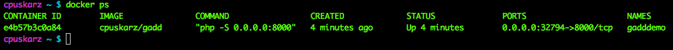
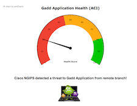
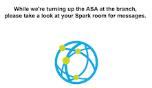

# gadd
##**Gomorrah Automated Distributed Defense**

# Description - Phase 1

The demo will highlight Spark and NFVIS along with ACI* and NGIPS*. The idea of the demo is:  based on an event/alert in the datacenter, dynamically deploy a FW at offending remote branch and post notifications in a Spark room. The branch site has a NFVis device and only has a virtual router deployed/functioning as a starting point.

For phase 1, we currently don't actually have an IPS in the lab, so we'll simulate the attack event. However, we do have ACI. Using the APIC APIs, we will gather health statistics of a tenant along with ingress/egress stats and send the information to our Spark room to simulate network impact.  

In Phase 2 the plan is to have an actual IPS to provide 'real' events to a real server runnning on an ACI fabric. Therefore it's important to note that for Phase 1, this demo ***is*** dependent on the ACI hardware inside our Chgo lab. To reiterate, please see the following notes:

* ***NOTE 1 - Phase 1: We'll be leveraging the local/internal labs for ACI and a NFVIS device, so you'll need connectivity to Cisco specific labs documented in this README. However, pending future deployments within Cisco DevNet/Sandbox and Mantl.io, this requirement should change.***

* ***NOTE 2 - Phase 2: When we do have Phase 2 built, we'll provide documentation on how you can deploy/run this demo in your own lab.***

# Installation

## Environment

**Prerequisites**

* Docker, running on a MAC. (Docker PC version of this document is coming at a later date).
* An account on: [developer.ciscospark.com](developer.ciscospark.com). (Create an account if you already don't have one).
* A Cisco Spark account: [web.ciscospark.com](web.ciscospark.com). (Create an account if you already don't have one). 
* If you don't have docker or are running a PC, we can run the demo with native python. However, you'll need to the following.
		
	* Python 2.7+ 
	* [setuptools package](https://pypi.python.org/pypi/setuptools)
	* [virtualenv](http://docs.python-guide.org/en/latest/dev/virtualenvs/)
	* [acitoolkit](http://datacenter.github.io/acitoolkit/) (installed in a virtualenv, which we'll cover later in this doc.)

## Downloading

We'll need to download the docker container and the repo files.

**Get the container:**

The latest build of this project is available as a Docker image from Docker Hub

    docker pull cpuskarz/gadd:2

**Get the repo:**

If you have git installed, clone the repository. 

    git clone https://github.com/imapex/gadd

If you don't have git, download a zip copy of the repository
and extract.

## Installing

We'll cover a two ways to install and run this demo. You have a choice of using either:  
**- Docker container (with GUI)**   
**- Running the python app native on our laptop (with GUI).** 

##Option A: Running the Docker container (MAC)
 
###Setup 
After downloading the container and cloning/downloading the repo per above:

* open a terminal and navigate into your downloaded repo directory
* cd into the``gadd``directory
* To make sure there's not an ASA deployment on the NFV device lingering from a previous demo, we'll setup your credentials then run cleanup script. First we'll need your Spark Token.
* To obtain your own token:  
	* log into``developer.ciscospark.com``.
	* Click the picture icon in the upper right hand corner of the page and copy your token from the 	pop-up window.

* Run these commands from the``gadd``directory. Don't close this window until demo is completed.
	
		source gadd_setup.sh	
		
	You'll be prompted for information:  
	
		* URL for NFVIS device, enter:	https://10.91.13.154
		* NFV login name, enter:		admin
		* NFV password, enter:			admin
		* Spark token, enter:			<paste your token>
		* URL for APIC device, enter:	http://10.91.86.180
		* APIC login name, enter:		devopsone
		* APIC password, enter:			devopsone
		* Trigger event IP, enter:		10.100.1.10
	
	Next lets set our NFVIS device to a clean setup:
	
		source clean_nfvis.sh
	
		

* Next, copy``gadd_dock_env_template``to``gadd_dock_env``
	* Paste the token into the``gadd_dock_env``file you created and save the file. Please keep the key word "Bearer". Here's an example:

            TOKEN_INPUT=Bearer R3VkYjXYZgtMTNiYy00YWQ2LY2TkYjXYZTgljNWE4Y2VkYjBlYTgTIyMXXXTktMzRm

	* Enter the remaining information (usernames, passwords, urls) into the``gadd_dock_env``file.  Note that quotations``""``aren't needed.          
* Let's start up the container next by running the following commands, (make sure you're back in the``gadd``directory and terminal you were in earlier):

		cd ui
		docker run -it -d -P --env-file=gadd_dock_env --name=gadddemo cpuskarz/gadd:2 
		
* We'll need the port number. ***Open another terminal window (don't close your current one).*** Enter:

		docker ps
		
	* You should see output similar to below. Take note of the **PORTS** number, for example**``32794``**:

	

	* You'll need your docker-machine IP address. If you don't know the IP, in your terminal window, type:``docker-machine ip``).  
	
	
Okay, now lets run the demo.

###Usage  

* Open your Spark client of choice.

* Open a browser to``http://<your docker up address>:<PORT_num>``. For example:

		http://192.168.99.100:32794
		

* You'll see something like this showing the application healthscore from ACI:

  
 

* Click the virus icon and watch for messages in Spark client (a new room called Gadd Alert Room will be created for you). 
* Once the messages complete and the NFV deployment, your webpage should change to:  

 

* Click the globe icon and you'll be taken back to the ACI healthscore page but with much better health!.  

* ***TBD click the Happy MAC icon to be taken to the NFV device page...***

##Option B: Python app on your laptop without Docker. 

###Setup

After cloning or downloading the repo to your laptop, (per above):

* open a terminal and navigate into your downloaded repo directory
* cd into the``gadd``directory
* Instantiate a [virtualenv](http://docs.python-guide.org/en/latest/dev/virtualenvs/) environment, for example:

		virtualenv venv
		source venv/bin/activate
* You should now be in a virtual enviroment (venv) terminal to load additional packages. From your venv enabled terminal window run:

		pip install --requirement requirements.txt
		
* install the [acitoolkit](http://datacenter.github.io/acitoolkit/) in your new virtualenv instance.

* copy the``gadd_setup_basic_template.sh``to``gadd_setup_basic.sh``.  

* The demo is using internal APIC and NFVis devices. ***Credentials will be provided or included in the template.*** (In the future we will provide an install script if you'd like to use your own APIC or NFVis device). You will need to provide your own Spark TOKEN_INPUT variable in the``gadd_setup_basic.sh``file. To obtain your own token:  
	* log into``developer.ciscospark.com``.
	* Click the picture icon in the upper right hand corner of the page and copy your token from the pop-up window.
	* Paste the token into the``gadd_dock_env``file you created and save the file. Please keep the key word "Bearer". Here's an example:

            TOKEN_INPUT=Bearer R3VkYjXYZgtMTNiYy00YWQ2LY2TkYjXYZTgljNWE4Y2VkYjBlYTgTIyMXXXTktMzRm

	* Enter the remaining information, (login_name, passwords, URL's) into the``gadd_setup_basic.sh``file. Note, that quotations``""`` are needed here.

* Execute the following commands from within the``gadd``directory, (make sure you're back in the``gadd``directory and terminal you were in earlier from within your virtualenv):

		source gadd_setup_basic.sh
		cd ui/gophp
		
	
* You now should be in the``gophp``directory. Execute the following commands:

		php -S 0.0.0.0:8000
				
Okay, now lets run the demo.	
	

###Usage
* Open your Spark client of choice.
* Open a browser to``http://localhost:8000``

* You'll see something like this showing the application healthscore from ACI:

  
 

* Click the virus icon and watch for messages in Spark client (a new room called Gadd Alert Room will be created for you). 
* Once the messages complete and the NFV deployment, your webpage should change to:  

 

* Click the globe icon and you'll be taken back to the ACI healthscore page but with much better health!.  

* ***TBD click the Happy MAC icon to be taken to the NFV device page...***

#___________________________________

# Development

Provide any notes for other contributors.  This includes how to run tests / etc

## TBD: Testing

The IMAPEX team should attempt to have unittests with  100% code coverage. An example test suite is contained
within the tests.py file for the boilerplate application

The tests are can be run in the following ways::

    python tests.py

When adding additional code or making changes to the project, please ensure that unit tests are added to cover the
new functionality and that the entire test suite is run against the project before submitting the code.
Minimal code coverage can be verified using tools such as coverage.py.

For instance, after installing coverage.py, the toolkit can be run with the command::

    coverage run tests.py

and an HTML report of the code coverage can be generated with the command::

    coverage html

# License

Include any applicable licenses here as well as LICENSE.TXT in the root of the repository

